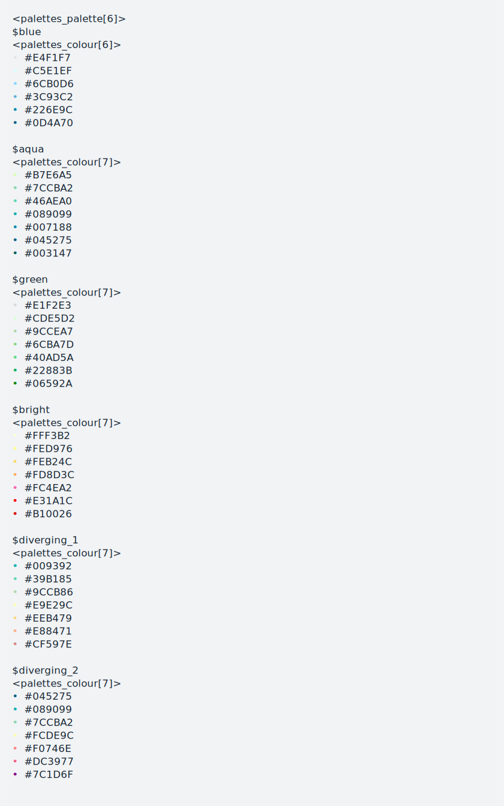
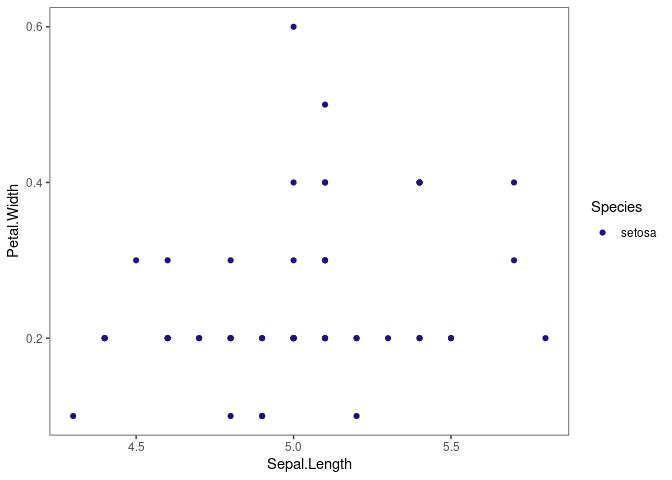
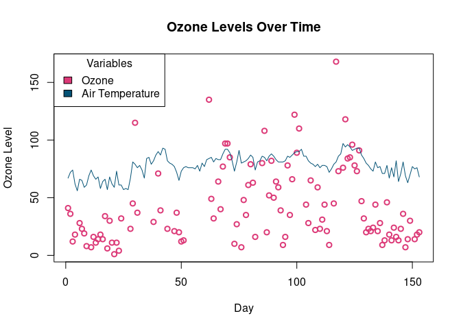

README
================
2024-02-05

## iCaMP Color Palette

Color palettes developed by Zachary Milstone, MD/PhD for use by the
integrative Cardiovascular Metabolism and Pathophysiology (iCaMP)
Program. Many of these palettes are colorblind friendly and have been
developed for use in conference and publication figures.

This package was created using the [Creating a colour palette package
vignette](https://mccarthy-m-g.github.io/palettes/articles/creating-packages.html)
and the [palettes
Package](https://mccarthy-m-g.github.io/palettes/index.html), both
developed by Michael McCarthy. Here are additional resources used in the
development of this package:

- [sunsets Package developed by Michael
  McCarthy](https://github.com/mccarthy-m-g/sunsets)
- [R Packages (2e) by Hadley Wickham & Jennifer
  Bryan](https://r-pkgs.org/)
- [A Helpful Way to Install R Packages Hosted on
  GitHub](https://cran.r-project.org/web/packages/githubinstall/vignettes/githubinstall.html)

## Included Palettes

    # Loading required package: palettes


## Installation

You can install icampcolors from [Github](https://github.com/) by doing
the following:

``` r

library(devtools)
# Loading required package: usethis

devtools::install_github("jcunha2023/icampcolors")
# Skipping install of 'icampcolors' from a github remote, the SHA1 (379f007c) has not changed since last install.
#   Use `force = TRUE` to force installation
```

## Usage

``` r

library(icampcolors)
```

icampcolors includes a distinct iCaMP blue color palette, a discrete
fluorescent color palette, a colorblind-friendly discrete color palette,
and six sequential color palettes. These can be accessed from the
following R objects:

- icamp_palettes_discrete for the sequential plettes
- icamp_palettes_sequential for the sequential palettes
  -icamp_color_palettes for all palettes

You can preview the palettes in the console by printing them:

``` r
icamp_palettes_sequential
```



Preview the palettes in the Plots pane with plot():


Subset palettes using \[, \[\[, and \$. - To extract one or more
palettes use \[:

``` r
icamp_palettes_sequential[c("blue", "bright")]
# <palettes_palette[2]>
# $blue
# <palettes_colour[6]>
# • #E4F1F7
# • #C5E1EF
# • #6CB0D6
# • #3C93C2
# • #226E9C
# • #0D4A70
# 
# $bright
# <palettes_colour[7]>
# • #FFF3B2
# • #FED976
# • #FEB24C
# • #FD8D3C
# • #FC4EA2
# • #E31A1C
# • #B10026
```

To get palette names use names():

    # [1] "blue"        "aqua"        "green"       "bright"      "diverging_1"
    # [6] "diverging_2"

## Example Use Cases

``` r
library(icampcolors)
library(ggplot2)
library(scales)
library(dplyr)
# 
# Attaching package: 'dplyr'
# The following objects are masked from 'package:stats':
# 
#     filter, lag
# The following objects are masked from 'package:base':
# 
#     intersect, setdiff, setequal, union
```

Using the Iris data set, you can display data points in iCaMP Blue:

``` r

setosa_data <- subset(iris, Species == "setosa")

ggplot(setosa_data, aes(Sepal.Length, Petal.Width))+
  geom_point(aes(color = Species))+
  theme_bw()+
  theme(panel.grid.major = element_blank(), panel.grid.minor = element_blank())+
  scale_color_palette_d(icamp_palettes_discrete$icamp_blue)
```



Here is an example of generating a heatmap with a diverging color
palette using the faithfuld data set:

``` r

ggplot(faithfuld, aes(eruptions, waiting, fill = density))+
  geom_tile()+
  theme_bw()+
  theme(panel.grid.major = element_blank(), panel.grid.minor = element_blank())+
  scale_fill_palette_c(icamp_color_palettes$diverging_1)
```


If you want a specific color from a palette, you can use indexing to
access the hex code:

``` r

setosa_data <- subset(iris, Species == "setosa")

ggplot(setosa_data, aes(Sepal.Length, Petal.Width))+
  geom_point(aes(color = Species))+
  theme_bw()+
  theme(panel.grid.major = element_blank(), panel.grid.minor = element_blank())+
  scale_color_palette_d(icamp_color_palettes$fluro[4])
```


Finally, icampcolors can be used with non-ggplot data visualization
tools in R. Here is an example of a graph displaying Ozone levels and
temperature from the ‘airquality’ dataset using the bright color
palette:

``` r

#create plot
plot(airquality$Ozone, type = "p", col = icamp_color_palettes$diverging_2[6], lwd = 2, xlab = "Day", ylab = "Ozone Level", main = "Ozone Levels Over Time")

lines(airquality$Temp, col = icamp_color_palettes$diverging_2[1])

#create legend
legend(x = "topleft", title = "Variables", 
       box.lwd = 1,
       legend = c("Ozone", "Air Temperature"),
       fill = c(icamp_color_palettes$diverging_2[6], icamp_color_palettes$diverging_2[1]))
```


